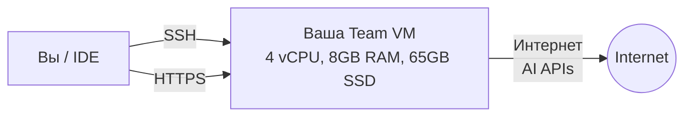

# AI Talent Camp Infrastructure

> Terraform-инфраструктура для AI Talent Camp

## Что это

Проект создает безопасную и управляемую инфраструктуру для проведения AI-хакатона с автоматическим развертыванием виртуальных машин для команд, прозрачным проксированием AI API и centralized управлением через Terraform.

## Ключевые возможности

- **Edge/NAT сервер** - единственная точка входа с публичным IP
- **Traefik** (Docker) - reverse proxy с TLS passthrough
- **Xray** (systemd service) - прозрачное проксирование AI API через TPROXY
- **Private Network** - изолированная сеть для команд
- **Team VMs** - отдельные VM для каждой команды (4 vCPU, 8GB RAM, 65GB SSD)
- **Автоматическое управление SSH ключами** - генерация и синхронизация credentials

## Архитектура

### Для команд

Простая схема для участников:



**Что у вас есть:**
- Выделенная виртуальная машина Ubuntu 22.04
- SSH доступ через центральную точку входа (прозрачно настроен)
- Полный root доступ (через sudo)
- Доменное имя для вашего приложения
- Доступ в интернет и к AI API

### Для администраторов

Детальная архитектура всей инфраструктуры см. в [docs/architecture.md](docs/architecture.md)

## Быстрый старт

### Для команд участников

Вы получаете выделенную виртуальную машину в облаке с полным доступом.

**Что вам нужно сделать:**

1. **Подключиться к VM** - см. [docs/quickstart.md](docs/quickstart.md)
   - SSH подключение через терминал
   - Подключение через VSCode/Cursor
   - Используйте готовые SSH ключи из папки `team-XX/`

2. **Настроить окружение** - см. [docs/user-guide.md](docs/user-guide.md)
   - Установить Docker и Docker Compose
   - Настроить Nginx как reverse proxy
   - Получить SSL сертификаты

3. **Развернуть приложение**
   - Запустить ваше приложение
   - Настроить доменное имя
   - Настроить CI/CD для автоматического деплоя

**Ваш домен:** `teamXX.camp.aitalenthub.com` (можно изменить, см. ниже)

## Работа с доменами

### Стандартный домен

Каждая команда получает поддомен: **`teamXX.camp.aitalenthub.com`**

Где `XX` - номер вашей команды (например, `team01`, `team02`, и т.д.)

### Переименование домена

Вы можете запросить изменение части `teamXX` на своё название:

1. Создайте [issue в репозитории](https://github.com/AI-Talent-Camp-2026/ai-talent-camp-2026-infra/issues/new)
2. Укажите:
   - Текущий домен: `teamXX.camp.aitalenthub.com`
   - Желаемое имя (только латиница, цифры, дефис)
   - Пример: `team01` → `myteam`
3. После одобрения получите: `myteam.camp.aitalenthub.com`

**Примечание:** Процесс занимает до 1 рабочего дня.

### Использование собственного домена

Если у вас есть свой домен, вы можете направить его на выданный поддомен:

1. Зайдите в настройки вашего DNS провайдера (Cloudflare, Namecheap, и т.д.)
2. Создайте CNAME запись:
   ```
   Тип: CNAME
   Имя: app (или любое другое)
   Значение: teamXX.camp.aitalenthub.com
   ```
3. Пример: `app.mydomain.com` → `team01.camp.aitalenthub.com`
4. На вашей VM получите SSL сертификат для `app.mydomain.com` (см. [user-guide.md](docs/user-guide.md))

**Важно:** Настройка DNS может занять до 48 часов.

## Подключение через IDE

### VSCode

1. Установите расширение **"Remote - SSH"**
2. Настройте SSH конфиг (см. [quickstart.md](docs/quickstart.md))
3. Подключитесь: `Cmd/Ctrl+Shift+P` → `Remote-SSH: Connect to Host...` → выберите `teamXX`
4. Работайте с удаленными файлами как с локальными!

Подробные инструкции см. в [docs/quickstart.md](docs/quickstart.md#подключение-через-vscodecursor)

### Для администраторов

Если вы развертываете инфраструктуру:

1. Установите [Prerequisites](docs/admin-guide.md#prerequisites)
2. Настройте [Yandex Cloud](docs/admin-guide.md#настройка-yandex-cloud)
3. Следуйте [пошаговому руководству](docs/admin-guide.md#развертывание-инфраструктуры)

**Быстрое развертывание:**

```bash
# Клонировать репозиторий
git clone https://gitlab.com/aitalenthub-core/ai-talent-camp-2026-infra.git
cd ai-talent-camp-2026-infra/environments/dev

# Настроить переменные
cp terraform.tfvars.example terraform.tfvars
nano terraform.tfvars

# Развернуть
terraform init
terraform apply
```

Подробнее см. [docs/admin-guide.md](docs/admin-guide.md)

## Документация

### Для пользователей (команды участников)

| Документ | Описание |
|----------|----------|
| [quickstart.md](docs/quickstart.md) | Быстрый старт - подключение и первое приложение |
| [user-guide.md](docs/user-guide.md) | Полное руководство пользователя |
| [troubleshooting.md](docs/troubleshooting.md) | Решение типичных проблем |

### Для администраторов

| Документ | Описание |
|----------|----------|
| [admin-guide.md](docs/admin-guide.md) | Развертывание и управление инфраструктурой |
| [xray-configuration.md](docs/xray-configuration.md) | Конфигурация Xray proxy |
| [architecture.md](docs/architecture.md) | Детальная архитектура |
| [modules.md](docs/modules.md) | Документация Terraform модулей |

### Для разработчиков

| Документ | Описание |
|----------|----------|
| [development.md](docs/development.md) | Стандарты разработки и contribution |
| [changelog.md](docs/changelog.md) | История изменений |

## Основные компоненты

### Для команд

**Team VM** - ваша виртуальная машина:
- **Ресурсы:** 4 vCPU, 8GB RAM, 65GB SSD
- **ОС:** Ubuntu 22.04 LTS
- **Доступ:** SSH (через центральную точку входа)
- **Права:** Полный sudo доступ
- **Интернет:** Прямой доступ ко всем сервисам
- **Домен:** `teamXX.camp.aitalenthub.com`

### Для администраторов

Подробная информация об архитектуре, Edge VM и всех компонентах инфраструктуры доступна в [docs/architecture.md](docs/architecture.md) и [docs/admin-guide.md](docs/admin-guide.md)

## Структура проекта

```
ai-talent-camp-2026-infra/
├── modules/              # Terraform модули
│   ├── network/          # VPC и подсети
│   ├── security/         # Security groups
│   ├── routing/          # Route tables
│   ├── edge/             # Edge/NAT VM
│   ├── team_vm/          # VM для команд
│   ├── team-credentials/ # Управление SSH ключами
│   └── config-sync/      # Синхронизация конфигов
│
├── environments/
│   └── dev/              # Development environment
│
├── templates/            # Конфигурационные шаблоны
│   ├── traefik/          # Traefik configs
│   ├── xray/             # Xray template
│   └── team/             # SSH configs
│
├── docs/                 # Документация
│   ├── quickstart.md
│   ├── user-guide.md
│   ├── admin-guide.md
│   ├── architecture.md
│   ├── xray-configuration.md
│   ├── troubleshooting.md
│   ├── modules.md
│   ├── development.md
│   └── changelog.md
│
├── secrets/              # Генерируемые ключи (gitignored)
│   ├── team-01/
│   ├── team-02/
│   ├── xray-config.json
│   └── traefik-dynamic.yml
│
└── README.md             # Этот файл
```

## Ресурсы

### По умолчанию

| Компонент | vCPU | RAM | Disk | Количество |
|-----------|------|-----|------|------------|
| Edge VM | 2 | 4GB | 20GB SSD | 1 |
| Team VM | 4 | 8GB | 65GB SSD | По числу команд |

## Технологии

- **Infrastructure as Code:** Terraform
- **Cloud Provider:** Yandex Cloud
- **OS:** Ubuntu 22.04 LTS
- **Reverse Proxy:** Traefik v3.0 (Docker)
- **Transparent Proxy:** Xray (systemd service)
- **Automation:** cloud-init

## Безопасность

- Network isolation (private subnet)
- SSH key-based authentication
- TLS passthrough (end-to-end encryption)
- Security groups с минимальными правами
- Audit logs (SSH, HTTP, proxy traffic)

## Поддержка

### Документация

См. раздел [Документация](#документация) выше для навигации по всем руководствам.

### Troubleshooting

При возникновении проблем проверьте [docs/troubleshooting.md](docs/troubleshooting.md)
