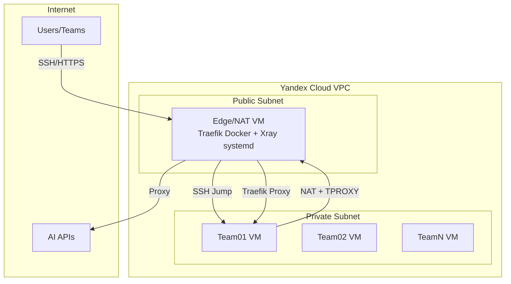

# AI Camp Infrastructure

> Terraform-инфраструктура для AI-Camp хакатона в Yandex Cloud  
> **Версия:** 2.0.0 | **Статус:** Production Ready

## Что это

Проект создает безопасную и управляемую инфраструктуру для проведения AI-хакатона с автоматическим развертыванием виртуальных машин для команд, прозрачным проксированием AI API и centralized управлением через Terraform.

## Ключевые возможности

- **Edge/NAT сервер** - единственная точка входа с публичным IP
- **Traefik** (Docker) - reverse proxy с TLS passthrough
- **Xray** (systemd service) - прозрачное проксирование AI API через TPROXY
- **Private Network** - изолированная сеть для команд
- **Team VMs** - отдельные VM для каждой команды (4 vCPU, 8GB RAM, 65GB SSD)
- **Автоматическое управление SSH ключами** - генерация и синхронизация credentials

## Архитектура



Подробнее см. [docs/architecture.md](docs/architecture.md)

## Быстрый старт

### Для команд участников

Если вы получили доступ к team VM:

1. Следуйте инструкциям в [docs/quickstart.md](docs/quickstart.md)
2. Используйте готовые SSH ключи из `secrets/team-XX/`
3. Подключайтесь через ProxyJump: `ssh -F ~/.ssh/ai-camp/ssh-config teamXX`

### Для администраторов

Если вы развертываете инфраструктуру:

1. Установите [Prerequisites](docs/admin-guide.md#prerequisites)
2. Настройте [Yandex Cloud](docs/admin-guide.md#настройка-yandex-cloud)
3. Следуйте [пошаговому руководству](docs/admin-guide.md#развертывание-инфраструктуры)

**Быстрое развертывание:**

```bash
# Клонировать репозиторий
git clone https://gitlab.com/aitalenthub-core/ai-talent-camp-2026-infra.git
cd ai-talent-camp-2026-infra/environments/dev

# Настроить переменные
cp terraform.tfvars.example terraform.tfvars
nano terraform.tfvars

# Развернуть
terraform init
terraform apply
```

Подробнее см. [docs/admin-guide.md](docs/admin-guide.md)

## Документация

### Для пользователей (команды участников)

| Документ | Описание |
|----------|----------|
| [quickstart.md](docs/quickstart.md) | Быстрый старт - подключение и первое приложение |
| [user-guide.md](docs/user-guide.md) | Полное руководство пользователя |
| [troubleshooting.md](docs/troubleshooting.md) | Решение типичных проблем |

### Для администраторов

| Документ | Описание |
|----------|----------|
| [admin-guide.md](docs/admin-guide.md) | Развертывание и управление инфраструктурой |
| [xray-configuration.md](docs/xray-configuration.md) | Конфигурация Xray proxy |
| [architecture.md](docs/architecture.md) | Детальная архитектура |
| [modules.md](docs/modules.md) | Документация Terraform модулей |

### Для разработчиков

| Документ | Описание |
|----------|----------|
| [development.md](docs/development.md) | Стандарты разработки и contribution |
| [changelog.md](docs/changelog.md) | История изменений |

## Основные компоненты

### Edge/NAT VM (2 vCPU, 4GB RAM)

**Сервисы:**
- **Traefik** - Docker контейнер для HTTP/HTTPS routing
- **Xray** - systemd сервис для TPROXY
- **NAT** - iptables для обычного трафика
- **SSH Bastion** - jump host для команд

### Team VM (4 vCPU, 8GB RAM, 65GB SSD)

**Для каждой команды:**
- Изолированная VM в private network
- SSH доступ через bastion
- Полный доступ в интернет (через NAT + TPROXY)
- Доменное имя: `teamXX.camp.aitalenthub.ru`

## Структура проекта

```
ai-talent-camp-2026-infra/
├── modules/              # Terraform модули
│   ├── network/          # VPC и подсети
│   ├── security/         # Security groups
│   ├── routing/          # Route tables
│   ├── edge/             # Edge/NAT VM
│   ├── team_vm/          # VM для команд
│   ├── team-credentials/ # Управление SSH ключами
│   └── config-sync/      # Синхронизация конфигов
│
├── environments/
│   └── dev/              # Development environment
│
├── templates/            # Конфигурационные шаблоны
│   ├── traefik/          # Traefik configs
│   ├── xray/             # Xray template
│   └── team/             # SSH configs
│
├── docs/                 # Документация
│   ├── quickstart.md
│   ├── user-guide.md
│   ├── admin-guide.md
│   ├── architecture.md
│   ├── xray-configuration.md
│   ├── troubleshooting.md
│   ├── modules.md
│   ├── development.md
│   └── changelog.md
│
├── secrets/              # Генерируемые ключи (gitignored)
│   ├── team-01/
│   ├── team-02/
│   ├── xray-config.json
│   └── traefik-dynamic.yml
│
└── README.md             # Этот файл
```

## Ресурсы

### По умолчанию

| Компонент | vCPU | RAM | Disk | Количество |
|-----------|------|-----|------|------------|
| Edge VM | 2 | 4GB | 20GB SSD | 1 |
| Team VM | 4 | 8GB | 65GB SSD | По числу команд |

### Стоимость (примерно)

Для 10 команд:
- Edge VM: ~1500₽/месяц
- Team VMs (10x): ~25000₽/месяц
- **Итого: ~26500₽/месяц**

## Технологии

- **Infrastructure as Code:** Terraform
- **Cloud Provider:** Yandex Cloud
- **OS:** Ubuntu 22.04 LTS
- **Reverse Proxy:** Traefik v3.0 (Docker)
- **Transparent Proxy:** Xray (systemd service)
- **Automation:** cloud-init

## Безопасность

- Network isolation (private subnet)
- SSH key-based authentication
- TLS passthrough (end-to-end encryption)
- Security groups с минимальными правами
- Audit logs (SSH, HTTP, proxy traffic)

## Поддержка

### Документация

См. раздел [Документация](#документация) выше для навигации по всем руководствам.

### Troubleshooting

При возникновении проблем:

1. Проверьте [docs/troubleshooting.md](docs/troubleshooting.md)
2. Просмотрите логи (Xray, Traefik, system)
3. Запустите `./scripts/check-docs.sh` для проверки документации
4. Создайте issue в репозитории

### Контакты

- **Repository:** https://gitlab.com/aitalenthub-core/ai-talent-camp-2026-infra
- **Documentation:** [docs/](docs/)
- **Issues:** GitLab Issues

## Лицензия

Проект для внутреннего использования AI Talent Hub.

---

**Версия:** 2.0.0 | **Последнее обновление:** 2026-01-29
