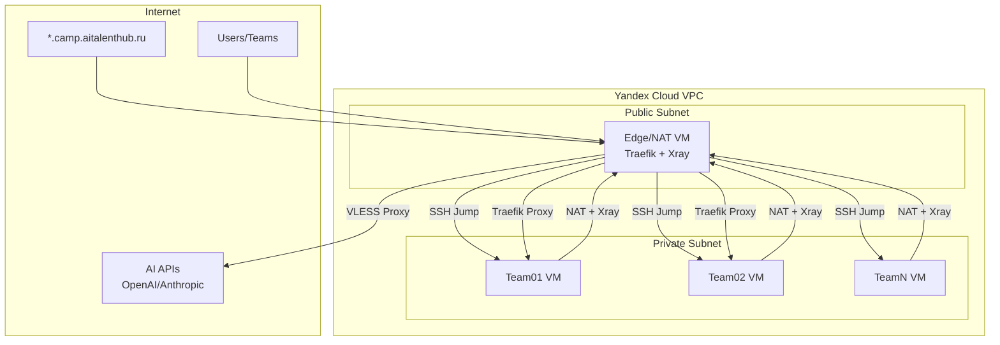

# AI Camp Infrastructure

Terraform-инфраструктура для AI-Camp хакатона в Yandex Cloud.

## Описание

Проект создает безопасную и управляемую инфраструктуру с:

- **Edge/NAT сервером** - единственная точка входа с публичным IP
- **Traefik** - reverse proxy с TLS passthrough
- **Xray/VLESS** - прозрачное проксирование AI API через TPROXY (OpenAI, Anthropic и др.)
- **Private Network** - изолированная сеть для команд
- **Team VMs** - отдельные VM для каждой команды (4 vCPU, 8GB RAM, 65GB SSD)

## Архитектура

```
                    Internet
                        ▼
              ┌───────────────────────┐
              │      DNS Records      │
              │ *.camp.aitalenthub.ru │
              └────────┬──────────────┘
                       ▼
┌──────────────────────────────────────────────────────┐
│                   Yandex Cloud VPC                   │
│  ┌────────────────────────────────────────────────┐  │
│  │              Public Subnet (192.168.1.0/24)    │  │
│  │  ┌──────────────────────────────────────────┐  │  │
│  │  │            Edge/NAT VM                   │  │  │
│  │  │  ┌─────────┐  ┌─────────┐  ┌─────────┐   │  │  │
│  │  │  │ Traefik │  │  Xray   │  │   NAT   │   │  │  │
│  │  │  │         │  │ TPROXY  │  │         │   │  │  │
│  │  │  └─────────┘  └─────────┘  └─────────┘   │  │  │
│  │  └──────────────────────────────────────────┘  │  │
│  └────────────────────────────────────────────────┘  │
│                          │ NAT + TPROXY              │
│                          ▼                           │
│  ┌────────────────────────────────────────────────┐  │
│  │             Private Subnet (10.20.0.0/24)      │  │
│  │  ┌──────────┐  ┌──────────┐  ┌──────────┐      │  │
│  │  │ Team01   │  │ Team02   │  │ Team...  │      │  │
│  │  │   VM     │  │   VM     │  │   VM     │      │  │
│  │  │(4vCPU/8G)│  │(4vCPU/8G)│  │(4vCPU/8G)│      │  │
│  │  └──────────┘  └──────────┘  └──────────┘      │  │
│  └────────────────────────────────────────────────┘  │
└──────────────────────────────────────────────────────┘
```




## Prerequisites

### Обязательные

- **Terraform** >= 1.0
  ```bash
  # Установка на Linux
  wget https://releases.hashicorp.com/terraform/1.6.0/terraform_1.6.0_linux_amd64.zip
  unzip terraform_1.6.0_linux_amd64.zip
  sudo mv terraform /usr/local/bin/
  ```

- **Yandex Cloud CLI** (`yc`)
  ```bash
  curl -sSL https://storage.yandexcloud.net/yandexcloud-yc/install.sh | bash
  ```

- **SSH клиент** (обычно предустановлен)

### Опциональные

- **jq** - для парсинга JSON outputs
  ```bash
  sudo apt install jq
  ```

## Настройка Yandex Cloud

### 1. Создание сервисного аккаунта

```bash
# Авторизация
yc init

# Создать сервисный аккаунт
yc iam service-account create --name terraform-sa

# Назначить роль editor
yc resource-manager folder add-access-binding <folder-id> \
  --role editor \
  --subject serviceAccount:<service-account-id>

# Создать authorized key
yc iam key create \
  --service-account-name terraform-sa \
  --output key.json
```

### 2. Настройка переменных окружения

```bash
export YC_TOKEN=$(yc iam create-token)
export YC_CLOUD_ID=$(yc config get cloud-id)
export YC_FOLDER_ID=$(yc config get folder-id)
```

Или через service account key:

```bash
export YC_SERVICE_ACCOUNT_KEY_FILE=/path/to/key.json
```

## Quick Start

### 1. Клонировать репозиторий

```bash
git clone https://gitlab.com/aitalenthub-core/ai-talent-camp-2026-infra.git
cd ai-talent-camp-2026-infra/environments/dev
```

### 2. Настроить переменные

```bash
cp terraform.tfvars.example terraform.tfvars
```

Отредактируйте `terraform.tfvars`:

```hcl
folder_id       = "your-folder-id"
jump_public_key = "ssh-ed25519 AAAA... admin@example.com"

# VLESS proxy (опционально)
vless_server     = "your-vless-server.example.com"
vless_server_ip  = "1.2.3.4"
vless_port       = 443
vless_uuid       = "xxxxxxxx-xxxx-xxxx-xxxx-xxxxxxxxxxxx"
vless_sni        = "www.microsoft.com"
vless_fingerprint = "chrome"
vless_public_key = "your-reality-public-key"
vless_short_id   = "your-short-id"

# Начальное развертывание - только NAT (без команд)
teams = {}
```

### 3. Поэтапное развертывание

#### Phase 1: Только NAT и Edge VM

```hcl
# terraform.tfvars
teams = {}
```

```bash
terraform init
terraform plan
terraform apply
```

Проверьте:
- Edge VM создана и имеет публичный IP
- NAT работает (можно проверить позже с тестовой VM)

#### Phase 2: Тестовая команда

```hcl
# terraform.tfvars
teams = {
  "01" = {
    user        = "team01"
    public_keys = []  # Ключи генерируются автоматически
  }
}
```

```bash
terraform apply
```

После применения Terraform создаст:
- VM для команды
- Полный набор ключей в `secrets/team-01/`

#### Phase 3: Остальные команды

Добавляйте команды по мере регистрации:

```hcl
teams = {
  "01" = { user = "team01", public_keys = [] }
  "02" = { user = "team02", public_keys = [] }
  "03" = { user = "team03", public_keys = [] }
  # ...
}
```

```bash
terraform apply  # Создаст только новые VM
```

### 4. Получить credentials для команд

После `terraform apply` для каждой команды создаётся папка в `secrets/`:

```
secrets/
├── team-01/
│   ├── team01-jump-key          # Ключ для bastion
│   ├── team01-jump-key.pub
│   ├── team01-key               # Ключ для VM
│   ├── team01-key.pub
│   ├── team01-deploy-key        # Для GitHub CI/CD
│   ├── team01-deploy-key.pub
│   └── ssh-config               # Готовый SSH конфиг
├── team-02/
│   └── ...
└── teams-credentials.json       # Сводка всех команд
```

Отправьте папку `secrets/team-XX/` команде.

### 5. Получить outputs

```bash
# Все outputs
terraform output

# Публичный IP edge
terraform output edge_public_ip

# SSH команды
terraform output team_ssh_commands

# Расположение credentials
terraform output team_credentials_folders
```

## Структура проекта

```
ai-talent-camp-2026-infra/
├── modules/
│   ├── network/          # VPC и подсети
│   ├── security/         # Security groups
│   ├── routing/          # Route tables для NAT
│   ├── edge/             # Edge/NAT VM с Traefik + Xray
│   └── team_vm/          # VM для команд
├── templates/
│   ├── traefik/          # Конфигурация Traefik
│   └── xray/             # Конфигурация Xray
├── environments/
│   └── dev/              # Development environment
│       ├── main.tf
│       ├── variables.tf
│       ├── outputs.tf
│       └── terraform.tfvars.example
├── secrets/              # Сгенерированные ключи (gitignored)
│   ├── team-01/
│   ├── team-02/
│   └── teams-credentials.json
├── docs/                 # Документация
└── README.md
```

## Конфигурация

### Основные переменные

| Переменная | Описание | По умолчанию |
|------------|----------|--------------|
| `folder_id` | Yandex Cloud folder ID | - |
| `zone` | Зона доступности | ru-central1-a |
| `network_name` | Имя VPC | ai-camp-network |
| `public_cidr` | CIDR публичной подсети | 10.0.1.0/24 |
| `private_cidr` | CIDR приватной подсети | 10.0.2.0/24 |
| `domain` | Базовый домен | camp.aitalenthub.ru |

### Ресурсы VM

| VM | vCPU | RAM | Disk | core_fraction |
|----|------|-----|------|---------------|
| Edge | 2 | 4GB | 20GB SSD | 100% |
| Team | 4 | 8GB | 65GB SSD | 100% |

### VLESS Proxy настройка

**Рекомендуемый способ:** Редактировать `secrets/xray-config.json` напрямую

После первого `terraform apply` создастся файл `secrets/xray-config.json` с полной конфигурацией Xray. Вы можете редактировать его напрямую и применять изменения через `terraform apply` без пересоздания VM.

```bash
# После первого apply
nano secrets/xray-config.json  # Отредактируйте VLESS параметры, routing и т.д.
terraform apply                # Синхронизирует изменения на edge VM
```

**Альтернативный способ:** Использовать переменные в terraform.tfvars

**Примечание:** Переменные используются только для генерации начального конфига. Если файл `secrets/xray-config.json` существует, он имеет приоритет.

| Переменная | Описание | Обязательно |
|------------|----------|-------------|
| `vless_server` | VLESS server hostname | Да (если используется) |
| `vless_server_ip` | VLESS server IP (для исключения из TPROXY) | Да |
| `vless_port` | VLESS port | 443 |
| `vless_uuid` | VLESS UUID | Да |
| `vless_sni` | Reality SNI | Да |
| `vless_fingerprint` | Browser fingerprint | chrome |
| `vless_public_key` | Reality public key | Да |
| `vless_short_id` | Reality short ID | Да |

### Добавление новой команды

В `terraform.tfvars`:

```hcl
teams = {
  "01" = {
    user        = "team01"
    public_keys = []  # Автоматически генерируются jump, vm, github ключи
  }
  "02" = {
    user        = "team02"
    public_keys = []  # Можно добавить дополнительные ключи
  }
  # Добавить новую команду:
  "03" = {
    user        = "team03"
    public_keys = []
  }
}
```

Применить изменения:

```bash
terraform apply
```

Terraform создаст только новые VM, не трогая существующие.

## Подключение к инфраструктуре

### Для команд (используя сгенерированные ключи)

Команда получает папку `secrets/team-XX/` и выполняет:

```bash
# 1. Скопировать папку
cp -r secrets/team-01 ~/.ssh/ai-camp
chmod 600 ~/.ssh/ai-camp/*-key

# 2. Подключиться к VM
ssh -F ~/.ssh/ai-camp/ssh-config team01
```

SSH config уже настроен с правильными ключами и ProxyJump.

### Для админа (через jump-host)

```bash
# Формат
ssh -J jump@<edge-public-ip> <team-user>@<team-private-ip>

# Пример
ssh -J jump@bastion.camp.aitalenthub.ru team01@10.0.2.10
```

### Проверка NAT и TPROXY

```bash
# На team VM - проверить внешний IP (должен быть IP edge VM)
curl ifconfig.co

# Проверить, что AI API идут через proxy
curl -v https://api.openai.com/v1/models
# Должен пройти через VLESS proxy (если настроен)
```

## DNS конфигурация

После применения terraform настройте DNS записи:

```
*.camp.aitalenthub.ru    A    <edge-public-ip>
bastion.camp.aitalenthub.ru    A    <edge-public-ip>
```

## Прозрачное проксирование (TPROXY)

Весь трафик из private subnet автоматически перехватывается через TPROXY и маршрутизируется через Xray:

- **AI APIs** (geosite:category-ai-!cn) → VLESS proxy
- **Соцсети** (YouTube, Instagram, TikTok, LinkedIn, Telegram, Notion) → VLESS proxy
- **Остальной трафик** → direct

Команды не настраивают ничего - всё работает прозрачно.

## Удаление инфраструктуры

```bash
cd environments/dev
terraform destroy
```

**Внимание:** Это удалит все ресурсы включая данные на VM!

## Troubleshooting

### Terraform не может подключиться к Yandex Cloud

```bash
# Проверить токен
echo $YC_TOKEN

# Или проверить service account key
echo $YC_SERVICE_ACCOUNT_KEY_FILE

# Обновить токен
export YC_TOKEN=$(yc iam create-token)
```

### VM не имеет доступа в интернет

1. Проверить route table привязан к private subnet
2. Проверить NAT на edge VM:
   ```bash
   # На edge VM
   sudo iptables -t nat -L -n -v
   ```
3. Проверить TPROXY:
   ```bash
   # На edge VM
   sudo iptables -t mangle -L XRAY -n -v
   ```

### SSH connection refused

1. Проверить security groups
2. Проверить SSH ключи в `secrets/team-XX/`
3. Проверить AllowTcpForwarding на edge

### TPROXY не работает

1. Проверить Xray контейнер запущен:
   ```bash
   # На edge VM
   docker ps | grep xray
   docker logs xray
   ```
2. Проверить iptables правила:
   ```bash
   sudo iptables -t mangle -L PREROUTING -n -v
   ```
3. Проверить policy routing:
   ```bash
   ip rule show
   ip route show table 100
   ```

### Подробнее см. [docs/usage.md](docs/usage.md)

## Документация

- [Документация модулей](docs/modules.md)
- [Руководство пользователя](docs/usage.md)

## Поддержка

При возникновении проблем:
1. Проверьте [Troubleshooting](#troubleshooting)
2. Просмотрите логи: `terraform apply` с `-debug`
3. Создайте issue в репозитории
