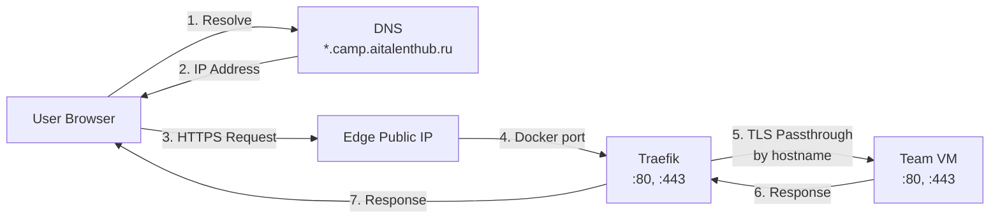
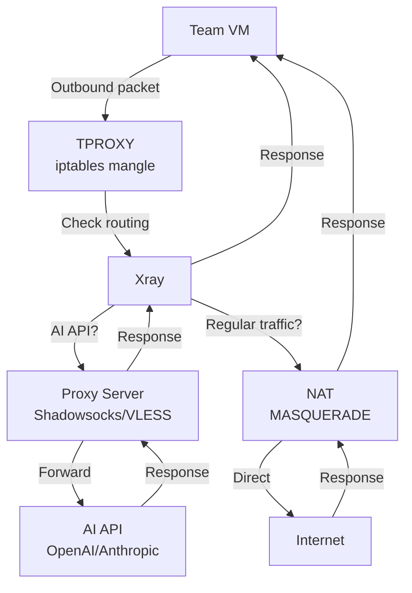
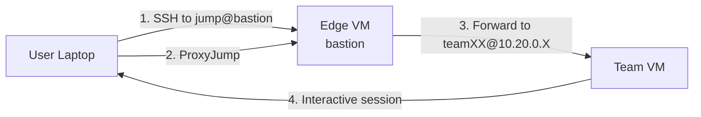

# Архитектура AI Camp Infrastructure

> **Последнее обновление:** 2026-01-29  
> **Связанные документы:** [modules.md](modules.md), [admin-guide.md](admin-guide.md)

## Обзор

AI Camp Infrastructure - это Terraform-проект для развертывания безопасной и управляемой инфраструктуры в Yandex Cloud для проведения AI-хакатона.

**Ключевые принципы:**
- ✅ Единая точка входа (Edge/NAT сервер)
- ✅ Изоляция команд в private network
- ✅ Прозрачное проксирование AI API
- ✅ Автоматизация через Terraform
- ✅ TLS passthrough для end-to-end шифрования

---

## Содержание

- [Высокоуровневая схема](#высокоуровневая-схема)
- [Компоненты инфраструктуры](#компоненты-инфраструктуры)
- [Сетевая топология](#сетевая-топология)
- [Потоки данных](#потоки-данных)
- [Security](#security)
- [Масштабирование](#масштабирование)

---

## Высокоуровневая схема

```
                    Internet
                        │
              ┌─────────┴─────────┐
              │   DNS Records     │
              │*.camp.aitalenthub.ru│
              └─────────┬─────────┘
                        │
        ┌───────────────┴───────────────┐
        │     Yandex Cloud VPC          │
        │  ┌────────────────────────┐   │
        │  │  Public Subnet         │   │
        │  │  (192.168.1.0/24)      │   │
        │  │  ┌──────────────────┐  │   │
        │  │  │   Edge/NAT VM    │  │   │
        │  │  │  ┌────────────┐  │  │   │
        │  │  │  │  Traefik   │  │  │   │  ← Docker
        │  │  │  │   (Docker) │  │  │   │
        │  │  │  ├────────────┤  │  │   │
        │  │  │  │    Xray    │  │  │   │  ← systemd
        │  │  │  │  (systemd) │  │  │   │
        │  │  │  ├────────────┤  │  │   │
        │  │  │  │    NAT     │  │  │   │  ← iptables
        │  │  │  │  (iptables)│  │  │   │
        │  │  │  └────────────┘  │  │   │
        │  │  └──────────────────┘  │   │
        │  └────────────────────────┘   │
        │              │                 │
        │              │ NAT + TPROXY    │
        │              ↓                 │
        │  ┌────────────────────────┐   │
        │  │  Private Subnet        │   │
        │  │  (10.20.0.0/24)        │   │
        │  │  ┌────────┬────────┐   │   │
        │  │  │ Team01 │ Team02 │   │   │
        │  │  │   VM   │   VM   │...│   │
        │  │  │ 4vCPU  │ 4vCPU  │   │   │
        │  │  │  8GB   │  8GB   │   │   │
        │  │  └────────┴────────┘   │   │
        │  └────────────────────────┘   │
        └───────────────────────────────┘
```

## Компоненты инфраструктуры

### 1. Edge/NAT VM

**Роль:** Единственная точка входа и выхода из инфраструктуры.

**Характеристики:**
- Public IP адрес
- 2 vCPU, 4GB RAM, 20GB SSD
- Ubuntu 22.04 LTS

**Запущенные сервисы:**

#### Traefik (Docker контейнер)
- **Назначение:** Reverse proxy для HTTP/HTTPS трафика
- **Режим:** TLS passthrough (не расшифровывает трафик)
- **Routing:** По hostname (`team01.camp.aitalenthub.ru` → Team01 VM)
- **Конфигурация:** `/opt/traefik/traefik.yml`, `/opt/traefik/dynamic/`

#### Xray (systemd сервис)
- **Назначение:** Прозрачное проксирование AI API и соцсетей
- **Механизм:** TPROXY (transparent proxy)
- **Протоколы:** Shadowsocks, VLESS, VMess, Trojan (конфигурируется)
- **Конфигурация:** `/opt/xray/config.json`
- **Почему systemd:** TPROXY требует `IP_TRANSPARENT` socket option

#### NAT (iptables)
- **Назначение:** Маршрутизация обычного трафика в интернет
- **Механизм:** MASQUERADE
- **Цель:** Весь трафик, не перехваченный TPROXY

#### TPROXY (iptables mangle)
- **Назначение:** Прозрачный перехват трафика
- **Механизм:** iptables mangle + policy routing
- **Цель:** AI API, YouTube, соцсети (по geosite правилам)

### 2. Team VM

**Роль:** Рабочая среда для каждой команды.

**Характеристики:**
- Private IP (без публичного доступа)
- 4 vCPU, 8GB RAM, 65GB SSD
- Ubuntu 22.04 LTS
- Рабочая директория: `/home/teamXX/workspace`

**Предустановлено:**
- Минимальная Ubuntu
- Пользователь с sudo правами
- SSH ключи

**Команды устанавливают сами:**
- Docker
- Nginx
- Языки программирования (Node.js, Python, Go и т.д.)
- Базы данных

---

## Сетевая топология

### VPC

```
ai-camp-network (VPC)
├── Public Subnet (192.168.1.0/24)
│   ├── Edge VM: 192.168.1.x
│   └── Gateway: 192.168.1.1
│
└── Private Subnet (10.20.0.0/24)
    ├── Team01 VM: 10.20.0.8
    ├── Team02 VM: 10.20.0.9
    ├── ...
    └── Gateway: 10.20.0.1 (edge VM private IP)
```

### Routing

#### Public Subnet
```
Destination         Gateway         Interface
0.0.0.0/0          internet        eth0
10.20.0.0/24       local           eth0
```

#### Private Subnet
```
Destination         Gateway              Interface
0.0.0.0/0          192.168.1.x (edge)   eth0
10.20.0.0/24       local                eth0
```

**Важно:** Route table для private subnet настроен так, что весь исходящий трафик идет через edge VM.

### Security Groups

#### Edge SG (yandex_vpc_security_group.edge)

**Ingress:**
| Протокол | Порт | Источник | Описание |
|----------|------|----------|----------|
| TCP | 22 | 0.0.0.0/0 | SSH |
| TCP | 80 | 0.0.0.0/0 | HTTP |
| TCP | 443 | 0.0.0.0/0 | HTTPS |
| ANY | - | 10.20.0.0/24 | From private subnet |
| ICMP | - | 0.0.0.0/0 | Ping |

**Egress:**
| Протокол | Порт | Назначение | Описание |
|----------|------|------------|----------|
| ANY | - | 0.0.0.0/0 | All outbound |

#### Team SG (yandex_vpc_security_group.team)

**Ingress:**
| Протокол | Порт | Источник | Описание |
|----------|------|----------|----------|
| TCP | 22 | Edge SG | SSH from bastion |
| TCP | 80 | Edge SG | HTTP from Traefik |
| TCP | 443 | Edge SG | HTTPS from Traefik |
| ANY | - | self | Team VMs intercommunication |
| ICMP | - | Edge SG | Ping from edge |

**Egress:**
| Протокол | Порт | Назначение | Описание |
|----------|------|------------|----------|
| ANY | - | 0.0.0.0/0 | All outbound (через edge) |

---

## Потоки данных

### Ingress Flow (HTTP/HTTPS)



**Описание:**
1. Пользователь запрашивает DNS для `team01.camp.aitalenthub.ru`
2. DNS возвращает публичный IP edge VM
3. Пользователь отправляет HTTPS запрос на edge VM
4. Traefik принимает запрос на порту 443
5. Traefik определяет целевую VM по SNI (Server Name Indication)
6. Traefik проксирует запрос на Team VM (TLS passthrough - без расшифровки)
7. Ответ возвращается пользователю

**Важно:** SSL-сертификат должен быть на Team VM, Traefik только проксирует.

### Egress Flow (Outbound Traffic)



**Описание:**

1. **Team VM отправляет пакет** (например, к `api.openai.com`)
2. **TPROXY перехватывает** пакет через iptables mangle
3. **Policy routing** направляет пакет на loopback с fwmark=1
4. **Xray dokodemo-door** принимает пакет на порту 12345
5. **Xray проверяет routing правила:**
   - Если домен/IP совпадает с geosite:category-ai → **proxy**
   - Если обычный трафик → **direct**
6. **Proxy:** Пакет шифруется и отправляется через Shadowsocks/VLESS
7. **Direct:** Пакет проходит через NAT MASQUERADE напрямую
8. Ответ возвращается обратно

### SSH Flow (Jump Host)



**Описание:**
1. Пользователь подключается к bastion с ключом `team01-jump-key`
2. SSH ProxyJump автоматически открывает туннель
3. Второе SSH соединение через туннель к Team VM с ключом `team01-key`
4. Пользователь получает интерактивную сессию на Team VM

**AllowTcpForwarding:** Должен быть включен на bastion для ProxyJump.

---

## Security

### Принципы безопасности

1. **Network Isolation**
   - Team VMs в private subnet без публичного IP
   - Доступ только через bastion (SSH) и Traefik (HTTP/HTTPS)

2. **Minimal Attack Surface**
   - Edge VM - единственная точка входа
   - Security groups ограничивают доступ

3. **TLS Passthrough**
   - Traefik не расшифровывает трафик
   - End-to-end шифрование

4. **SSH Key Authentication**
   - Пароли отключены
   - Уникальные ключи для каждой команды

5. **Audit Trail**
   - Логи SSH подключений
   - Логи HTTP/HTTPS запросов (Traefik)
   - Логи proxy трафика (Xray)

### SSH Ключи

Для каждой команды генерируются **3 пары ключей:**

1. **Jump Key** (`team01-jump-key`)
   - Для подключения к bastion
   - Публичный ключ на edge VM в `/home/jump/.ssh/authorized_keys`

2. **VM Key** (`team01-key`)
   - Для подключения к Team VM
   - Публичный ключ на Team VM в `/home/team01/.ssh/authorized_keys`

3. **Deploy Key** (`team01-deploy-key`)
   - Для GitHub Actions / CI/CD
   - Опционально добавляется в GitHub repo → Settings → Deploy keys

### Security Groups Flow

```
Internet
   │
   ├─→ :22, :80, :443 ─→ Edge VM (allowed)
   │
   └─→ Any other port ─→ Edge VM (denied)

Edge VM
   │
   ├─→ :22, :80, :443 ─→ Team VM (allowed)
   │
   └─→ Any other port ─→ Team VM (denied)

Team VM
   │
   └─→ All ports ─→ Edge VM ─→ Internet (allowed)
```

---

## Масштабирование

### Добавление новой команды

1. **Обновить `terraform.tfvars`:**
   ```hcl
   teams = {
     "01" = { user = "team01", public_keys = [] }
     "02" = { user = "team02", public_keys = [] }
     "03" = { user = "team03", public_keys = [] }  // новая
   }
   ```

2. **Применить изменения:**
   ```bash
   terraform apply
   ```

3. **Terraform создаст:**
   - ✅ Новую VM в private subnet
   - ✅ SSH ключи в `secrets/team-03/`
   - ✅ Traefik routing для `team03.camp.aitalenthub.ru`
   - ✅ Обновит authorized_keys на bastion

4. **Настроить DNS:**
   ```
   team03.camp.aitalenthub.ru  A  <edge-public-ip>
   ```

**Время развертывания:** ~3-5 минут.

### Удаление команды

1. **Удалить из `terraform.tfvars`**
2. **Применить изменения:** `terraform apply`
3. **Terraform удалит:**
   - VM команды
   - SSH ключи из bastion
   - Traefik routing

⚠️ **Внимание:** Данные на VM будут потеряны. Сделайте backup перед удалением.

### Вертикальное масштабирование

Для изменения ресурсов VM (CPU/RAM/Disk):

**В `terraform.tfvars`:**
```hcl
team_cores       = 8      // было 4
team_memory      = 16     // было 8
team_disk_size   = 100    // было 65
```

⚠️ **Внимание:** Это пересоздаст VM. Данные будут потеряны.

### Горизонтальное масштабирование

**Текущие ограничения:**
- Одна команда = одна VM
- Нет load balancing между VM

**Возможное расширение:**
- Multiple VMs per team
- Internal load balancer
- Shared storage (NFS/Ceph)

---

## Мониторинг

### Доступные метрики

**Edge VM:**
- CPU, RAM, Disk usage
- Network traffic (in/out)
- Количество SSH подключений
- Количество HTTP requests (Traefik)
- Proxy traffic volume (Xray)

**Team VM:**
- CPU, RAM, Disk usage
- Network traffic (in/out)
- Running processes

### Логи

**Locations:**
- Traefik: `docker logs traefik`
- Xray: `/var/log/xray/access.log`, `/var/log/xray/error.log`
- System: `/var/log/syslog`, `journalctl`

**Retention:** 7 дней (по умолчанию).

---

## Limitations

**Текущие ограничения:**

1. **Single region:** ru-central1-a (Yandex Cloud)
2. **No HA:** Single edge VM (single point of failure)
3. **No auto-scaling:** Fixed number of VMs
4. **No shared storage:** Each VM has isolated filesystem
5. **Manual DNS:** DNS records нужно настраивать вручную

**Возможные улучшения:**
- Multi-AZ deployment
- Load balancer перед edge VM
- Auto-scaling для team VMs
- Shared storage (NFS, Ceph)
- Automatic DNS management (External DNS)

---

## См. также

- [modules.md](modules.md) - детальное описание Terraform модулей
- [admin-guide.md](admin-guide.md) - руководство администратора
- [user-guide.md](user-guide.md) - руководство пользователя
- [xray-configuration.md](xray-configuration.md) - конфигурация Xray
